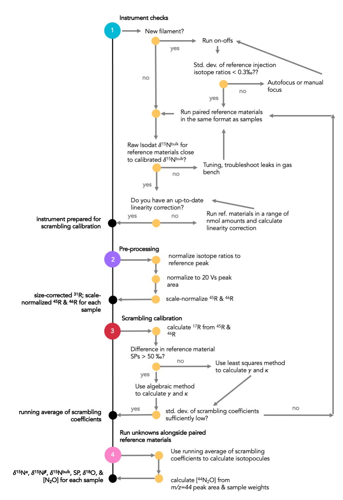

# pyisotopomer

[](https://pypi.org/project/pyisotopomer)
[](https://doi.org/10.5281/zenodo.5031218)
[](https://opensource.org/licenses/MIT)
[](https://github.com/psf/black)

Hello!

pyisotopomer is a Python toolbox for processing nitrous oxide (N<sub>2</sub>O) isotopomer data. Its core is a package of scripts to correct for scrambling in the ion source during isotope ratio mass spectrometry. An alternate version of this package exists for [MATLAB](https://github.com/ckelly314/m-isotopomer).

## Intro

While the scrambling calibration is an integral part of obtaining high-quality N<sub>2</sub>O  isotopocule data from isotope ratio mass spectrometry, this calibration is part of a larger data processing pipeline. The scrambling calibration and isotopocule calculation steps can be performed in pyisotopomer.



**Contents:**
- [pyisotopomer](#pyisotopomer)
  - [Basic use](#basic-use)
  - [Configuring python: macOS](#configuring-python-macOS)
  - [Configuring python: Windows](#configuring-python-windows)
  - [Pre-processing](#pre-processing)
  - [Scrambling calibration](#scrambling-calibration)
  - [Calculating isotopomers](#calculating-isotopomers)
  - [Calculating concentrations](#calculating-concentrations)

## Basic use

The import convention for pyisotopomer is:

```Python
from pyisotopomer import Scrambling, Isotopomers
```

To calculate scrambling coefficients, the only function you need is:

```Python
Scrambling(inputfile="FILENAME.xlsx", ref1="NAME", ref2="NAME", **kwargs)
```

To calculate isotopomers, the only function you need is:

```Python
Isotopomers(inputfile = "FILENAME.xlsx", scrambling = [0.1..., 0.0...], **kwargs)
```

You can walk through these steps in this [Jupyter Notebook](https://github.com/ckelly314/pyisotopomer/blob/master/tests/run_pyisotopomer.ipynb).

## Configuring Python: macOS

Check that you have python3 installed on your computer. On macOS, open a new Terminal window (see below for instructions for Windows). Run the following command:

```bash
colette$ python3 --version
```

This should output something like:

```bash
Python 3.9.2
```

Note that the text before the dollar sign will vary based on the user and computer. Additionally, the dollar sign may be replaced by a percent sign if your terminal is in zshell (zsh) instead of bash, but this is not an important difference for the code below. If python3 is not yet installed on your computer, try this [helpful guide](https://github.com/stanfordpython/python-handouts/blob/master/installing-python-macos.md) for installing Python as well as working with virtual environments.

Install pyisotopomer. Run:

```bash
colette$ pip install --upgrade pip
colette$ pip install pyisotopomer
```

This may take a while; pip (the Python package manager) will download pyisotopomer and its dependencies from the cloud and install them on your machine. 

## Configuring Python: Windows

Requires: 64-bit Windows 10, updated to the 2016 Anniversary build or later. *If you regularly download updates, you'll be fine.*

Windows 10 has added a subsystem called Ubuntu that allows you to open a bash shell. If you don't know what a bash shell is, that's totally fine — just follow the instructions below.

First, follow [these instructions](https://www.howtogeek.com/249966/how-to-install-and-use-the-linux-bash-shell-on-windows-10/) from HowToGeek. These will help you activate the "Windows Subsystem for Linux," get Ubuntu from the Microsoft Store, and launch a `bash` shell on Ubuntu.

Once you're in the `bash` shell, run the following commands to install Python 3.9 on your computer:

```bash
$ sudo add-apt-repository ppa:deadsnakes/ppa
$ sudo apt-get update
$ sudo apt-get install python3.9
```

You can check which version of Python you've installed by running:

```bash
$ python3 --version
```

This should output something like:

```bash
Python 3.9.2
```

Install pyisotopomer. Run:

```bash
$ pip install "prompt-toolkit==2.0.10" "ipython[all]" pyisotopomer
```

This may take a while; pip (the Python package manager) will download pyisotopomer and its dependencies from the cloud and install them on your machine. 

## Pre-processing

Download the data correction [template](https://github.com/ckelly314/pyisotopomer/blob/master/src/pyisotopomer/00_Python_template.xlsx).

Export IRMS data in Isodat, with separate export templates for the sample peak and designated reference peak for each sample.

Open the .xls file containing Isodat output. Note that the spreadsheet contains two tabs: one contains raw data for each sample, and the other contains raw data for the designated reference peak for each sample.

In the "sample" tab, bring all fragment data in line, then delete extra rows. Do the same in the "standard" tab.

Open the data correction template. Copy the raw sample data from columns A-O in the sample tab into columns C-Q in the correction template. Copy the "rR" columns from the standards tab (columns M, N, O) into columns S, T, U in the correction template.

Replace the values in row 3, columns W-Y with the appropriate 31R, 45R, and 46R for your N<sub>2</sub>O reference gas (the reference gas used for on-offs/direct injections). The values in the template spreadsheet are specific to the Casciotti Lab's N<sub>2</sub>O reference gas. 

Replace the values in row 7, columns W-Y, with your size correction slopes. Ensure that these size correction slopes are normalized to the m/z 44 peak area. Ensure that they apply to the raw "ratio of ratios" 31rR/31rR, 45rR/45rR, and 45rR/45rR in columns AA-AC. The values in the template spreadsheet are specific to the linearity of the Casciotti Lab Delta V, as of February-March 2021.

The 31R, 45R, and 46R for each sample, normalized to the common reference injection and normalized to a m/z 44 peak area of 20 Vs, are found in columns AI-AK. Save the correction template with a new name into your current working directory.

## Scrambling calibration:

Download [constants.csv](https://github.com/ckelly314/pyisotopomer/blob/master/src/pyisotopomer/constants.csv).

Open ```constants.csv```. Here, we specify the calibrated isotope ratios of named reference materials. If the reference materials to be used to calibrate scrambling are not in this list, add them, following the format of the existing lines. Save ```constants.csv``` into your current working directory.

Download this [Jupyter Notebook](https://github.com/ckelly314/pyisotopomer/blob/master/tests/run_pyisotopomer.ipynb). Save it into your current working directory.

Here, two coefficients, γ and κ, are used to describe scrambling in the ion source. This is described in further detail in [Frame and Casciotti, 2010](https://www.biogeosciences.net/7/2695/2010/). Below is a description of how to calculate these coefficients in pyisotopomer.

Run two (or more) reference gases with known 15R-alpha and 15R-beta, prepared in the same format as samples (i.e., some amount of N<sub>2</sub>O reference gas injected into a bottle of seawater or DI water that has been purged with He or N2 gas).

Export and size-correct these data in the excel correction template, as above. The placeholder samples in the template spreadsheet are arranged in the right order 1-7, but this may not necessarily be the case, depending on how one performs the steps above. The order is not important to what follows, as long as the samples (columns C-Q) and reference peaks (columns S-U) are in the same order.

Each row of the correction template represents one reference material. In column B, "ref_tag", add the names of the reference materials, as they appear in ```constants.csv``` (for example, here, atmosphere-equilibrated seawater is named "ATM").

DO NOT MODIFY COLUMN HEADERS IN THE CORRECTION TEMPLATE. Save the correction template into your current working directory.

Open a terminal window. Launch Jupyter Notebook:

```bash
colette$ jupyter notebook
```

This should open Jupyter in a new browser window. In Jupyter, navigate to your current working directory. Click on ```run_pyIsotopomer.ipynb``` to open the Jupyter Notebook containing the code to run pyisotopomer.

Follow the instructions in the Jupyter Notebook to run pyisotopomer and obtain scrambling coefficients for all possible pairings of reference materials. This will create an output file entitled ```{date}_scrambling_output.xlsx``` with scrambling output.

## Calculating isotopomers

Size-correct your data (including all samples and standards), as above. 

DO NOT MODIFY COLUMN HEADERS IN THE CORRECTION TEMPLATE. Save the correction template into your current working directory.

Open a terminal window. Launch Jupyter Notebook:

```bash
colette$ jupyter notebook
```

This should open Jupyter in a new browser window. In Jupyter, navigate to your current working directory. Click on ```run_pyIsotopomer.ipynb``` to open the Jupyter Notebook containing the code to run pyisotopomer.

Follow the instructions in the Jupyter Notebook to run pyisotopomer and obtain sample isotopocule values in delta notation, as well as isotope ratios.

### How to think about scrambling when calculating isotopomers

You will also need to enter the appropriate scrambling coefficients in the call to the Isotopomers function. These scrambling coefficients should represent a running average of γ and κ calculated from at least 10 pairings of reference materials (e.g. a week's worth, if unknowns are bookended by reference materials) run alongside unknowns. 

The scrambling coefficients should not be those calculated alongside one run of unknowns. This is because a 1% standard deviation in the scrambling coefficients leads to an error of ~4‰ in site preference, so it is advisable to run sufficient reference materials to bring the standard deviation of γ and κ below this threshold.

### ---

The Isotopomers function will create an output .csv file, i.e., ```{date}_isotopeoutput.csv```. Copy and paste output data back into working (size correction) spreadsheet in olive-highlighted cells (columns AM-AR).

Note that a scale decompression may be applied after the isotopomer calculation. This is calculated in the “scale-decompression” tab of the excel worksheet, and is applied in columns AU-AZ of the size_correction tab. The scale decompression should be applied as an average 

## Calculating concentrations

To calculate the concentrations of <sup>44</sup>N<sub>2</sub>O, <sup>45</sup>N<sub>2</sub>O-α, <sup>45</sup>N<sub>2</sub>O-β, and <sup>46</sup>N<sub>2</sub>O:

Calculate the amount (nmol) of <sup>44</sup>N<sub>2</sub>O in your sample from the ratio of mass 44 peak area to N<sub>2</sub>O (nmol/Vs) for your instrument. For high levels of <sup>15</sup>N enrichment, account for masses 45 and 46 as well when calculating the total N<sub>2</sub>O.

Use the weight difference of the bottle pre- and post-analysis to determine the volume of sample run, and thus the concentration of <sup>44</sup>N<sub>2</sub>O.

We calculate the concentrations of <sup>45</sup>N<sub>2</sub>O-α, <sup>45</sup>N<sub>2</sub>O-β, and <sup>46</sup>N<sub>2</sub>O (for tracer experiments) from the delta value and associated 15/14 ratios. For high levels of <sup>15</sup>N enrichment, use atom fraction <sup>15</sup>N and 14</sup>N rather than isotope ratios.
